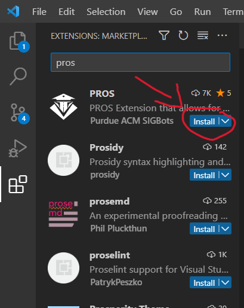
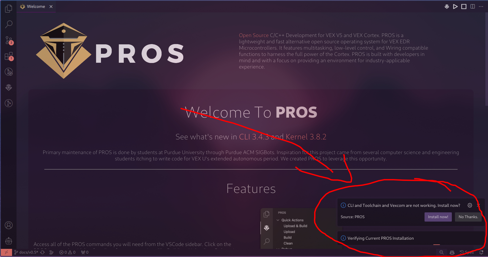

# How To Use
There are a few steps to use this code.

## Dependencies
First, you need to install PROS in VSC. Here's how to do that:

**1. Install PROS extension**

Navigate to the extensions tab on the sidebar in VSC (3 blocks with 4th block falling icon). Then, search PROS. Install it.

[PROS Documentation](https://pros.cs.purdue.edu/)

**2. Install Toolchain**

After installing PROS, a notification will appear to install the toolchain. Install it.

**3. Clangd**
Install the Clangd extension the same way you did PROS. Then, reload.

## Clone Repo
Then, run the following command to clone this repo.
`git clone https://github.com/K-man1/7-ball.git`

## Config
Go through robot_config.cpp and replace it with your actual robot configuration. You can learn how to do this in the [Lemlib Docs](https://lemlib.readthedocs.io/en/stable/tutorials/2_configuration.html)

Replace logo.c with your own logo. You can learn how to that [here](https://www.youtube.com/watch?v=TMcAzTsPj2w).

## Robot Specs
For this, you need a 6 motor drivetrain with motor encoders (already built built into the robot). You also need 3 distance sensors, one on the back, right and left of the robot. You can change the offsets in robot.h.

## How to Upload
To upload this project, plug your computer into the VEX V5 brain using a USB-A -> Micro-USB cable, and type `pros build` and then `pros upload` into the intergrated terminal.
